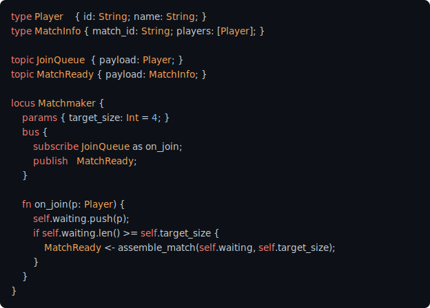
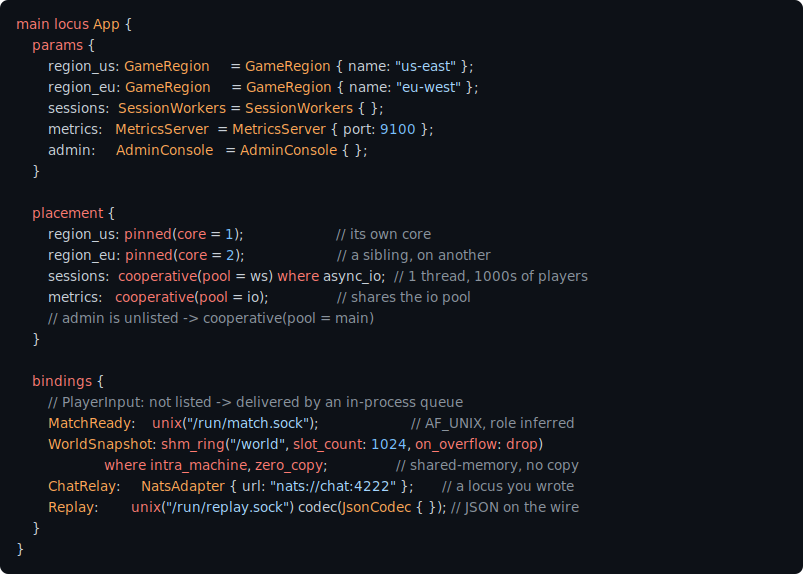

# Hale

**You describe a system — the services, the messages between them,
who owns what — and that description *is* the program.**

One primitive, the **locus**, scales from a single function to a
whole distributed system. There's no translation layer between the
sentence you'd say out loud and the code you write.

[](https://github.com/hale-lang/hale/actions/workflows/tests.yml)
[](https://hale-lang.github.io/hale/)
[](./LICENSE)
[](https://llvm.org/)
[](#what-you-dont-write)
[](#what-you-dont-write)
[](./AGENTS.md)

You know the feeling: you describe a system out loud —
*"a matchmaker holds a queue of waiting players, spawns a match when
enough are queued, then goes back to waiting"* — and the code you
actually write bears no resemblance to the sentence. Mutexes appear.
Async machinery. Lifecycle wiring. Five files. By the time it works,
the idea you started with is buried.

Hale is a bet that the gap doesn't have to be there.

## A matchmaker, in Hale

<!-- Rendered SVG (GitHub can't highlight `hale` itself). Source:
     assets/readme/matchmaker.hl; regenerate with
     `python3 tools/hale_svg.py assets/readme/matchmaker.hl assets/readme/matchmaker.svg`.
     The copyable source is in the <details> below; keep the two in sync. -->


<details>
<summary>Source</summary>

```hale
type Player    { id: String; name: String; }
type MatchInfo { match_id: String; players: [Player]; }

topic JoinQueue  { payload: Player; }
topic MatchReady { payload: MatchInfo; }

locus Matchmaker {
    params { target_size: Int = 4; }
    bus {
        subscribe JoinQueue as on_join;
        publish   MatchReady;
    }

    fn on_join(p: Player) {
        self.waiting.push(p);
        if self.waiting.len() >= self.target_size {
            MatchReady <- assemble_match(self.waiting, self.target_size);
        }
    }
}
```

</details>

Every phrase from the description has a syntactic home, in the order
you thought them:

- *"a service"* → `locus Matchmaker`
- *"receives players wanting matches"* → `subscribe JoinQueue as on_join`
- *"announces matches"* → `publish MatchReady`
- *"when enough are queued"* → the `if`

No mutex to choose, no channel types, no `async`/`await`, no
lifecycle wiring, no error handling at every boundary. You wrote down
the idea; the idea is the program.

## One primitive, at any altitude

Most languages pick a level and stay there — Python and JavaScript
high, Go in the middle, Rust and C++ low. Hale is one language you
write at any of them, moving between levels without changing tools.
There's a single building block — the **locus** — and the only thing
that changes as you go down is how much of it you choose to see.

| Altitude | You write… | Feels like… |
|---|---|---|
| **The basics** | variables, math, functions, control flow | a clean scripting language |
| **Everyday programs** | files, JSON, HTTP, loci as objects | Python / Node |
| **Concurrent services** | a typed bus, lifecycle, supervision | Go / Erlang |
| **Systems control** | memory layout, lifetime, zero-copy I/O, C bindings | Rust / C++ |

A function you wrote at the top still works at the bottom — you've
just learned to see more of what was always there. The
[docs](https://hale-lang.github.io/hale/) are organized as exactly
this descent, so you go only as deep as you need.

## What you don't write

A lot of the appeal is what *isn't* there to trip over — or to make
a coding model hallucinate:

- **No `class`, `module`, `package`** — the **locus** is all of them.
  Apps, services, caches, handlers, libraries: all loci.
- **No `Vec<T>` / `Map<K,V>` ceremony** — declare a collection with
  `@form` on a locus and get `push` / `get` / `len` synthesized,
  type-specialized to your element.
- **No `async` / `await`** — concurrency lives on a typed message bus
  and the locus lifecycle. No function-coloring problem, because
  there are no async functions to color.
- **No GC, and no borrow checker** — the locus hierarchy is explicit,
  so cleanup is deterministic when a locus dissolves. You never write
  `free`, and you never fight a lifetime annotation.
- **No exceptions, no `panic` / `assert`** — a call that can fail says
  so in its type, and you address it right at the call site. Nothing
  propagates invisibly.

## You declare intent; the compiler picks the mechanism

Each block on a locus states *what you mean* on an axis where other
languages make you hand-pick a mechanism:

- **`topic` + `bus { subscribe/publish }`** — what crosses between
  loci. The binary picks the transport (in-process queue, socket,
  shared-memory ring, broker) without touching your logic.
- **`placement { }`** — where loci run: a shared cooperative pool, a
  dedicated thread, a pinned core, a NUMA node. Decided at deployment.
- **`@form(vec / hashmap / ring_buffer / lru_cache)`** — a
  collection's access discipline; you get a tight, specialized
  implementation.
- **`mode bulk / harmonic / resolution`** — an execution regime; the
  compiler emits vectorized, cache-tiled, or scalar code to match.

The choices easy to get wrong — which lock, which container, which
transport — stop being choices you make at the call site. It's also
why Hale is unusually pleasant to write *with* a coding model: the
things models hallucinate on aren't in the code.

## Deploy by editing `main`

Where each locus runs and how its messages travel come together in
the `main` locus — the control panel for the whole program. The loci
themselves never mention threads or transports; `main` does, in one
place:

<!-- Rendered SVG; source assets/readme/placement.hl, regenerate with
     `python3 tools/hale_svg.py assets/readme/placement.hl assets/readme/placement.svg`.
     Copyable source is in the <details>; keep the two in sync. -->


<details>
<summary>Source</summary>

```hale
main locus App {
    params {
        region_us: GameRegion     = GameRegion { name: "us-east" };
        region_eu: GameRegion     = GameRegion { name: "eu-west" };
        sessions:  SessionWorkers = SessionWorkers { };
        metrics:   MetricsServer  = MetricsServer { port: 9100 };
    }

    placement {
        region_us: pinned(node = 0);                       // thread + memory on NUMA node 0
        region_eu: pinned(node = 1);                       // a sibling, on the other node
        sessions:  cooperative(pool = ws) where async_io;  // 1 thread, thousands of players
        metrics:   cooperative(pool = io);                 // shares the io pool
    }

    bindings {
        MatchReady:    unix("/run/match.sock");                       // AF_UNIX, role inferred
        WorldSnapshot: shm_ring("/world", slot_count: 1024, on_overflow: drop)
                      where intra_machine, zero_copy;                 // shared memory, no copy
        ChatRelay:     NatsAdapter { url: "nats://chat:4222" };       // a locus you wrote
        Replay:        unix("/run/replay.sock") codec(JsonCodec { }); // JSON on the wire
    }
}
```

</details>

Not one line of `GameRegion`, `SessionWorkers`, or `MetricsServer`
changes whether `MatchReady` is an in-process queue or a Unix socket,
or whether `region_us` owns a NUMA node or shares the main thread. You
design the system once and redeploy it — test, single binary,
multi-host — by editing `main`.

And you can redeploy it **while it runs.** A `perspective` is a live,
swappable handle to a contract; `reperspective` re-points it at a new
implementation with a single atomic store — hot code-swap at
pointer-flip cost, no restart:

```hale
reperspective self.router as RouterV2;   // every caller sees V2 on the next call
```

`topology { }` to describe the machine, `placement { }` to map
components onto its cores and memory, `reperspective` to redeploy them
live. Kubernetes-shaped, in a single address space, at nanosecond
cost.

## Verified by construction

The substrate you stand on is checked, not hoped. Every concurrent
primitive in the runtime — the lock-free map, the mailbox, the bus
queue, the arena — is **model-checked under every interleaving**
([GenMC](https://github.com/MPI-SWS/genmc)) on each CI run. Above it,
the compiler walks the bus topology as a typed graph at build time:
orphaned topics, re-entrant cycles, unbounded backpressure, and
payload type-mismatches are caught before the program runs. You don't
get a "verified" sticker on your whole program — you get a foundation
whose coordination can't silently race.
[Verification →](https://hale-lang.github.io/hale/verification.html)

## See it on your own code

Before you install anything: in your coding assistant of choice, drop
this project's [`AGENTS.md`](./AGENTS.md) into context and ask it to
re-read a module from your existing codebase **as loci, contracts, and
bus topics**. What usually comes back is a decomposition that matches
your mental model — because the model is reasoning in the same
vocabulary you already use about your system. If it looks right,
you've felt the fit without writing a line of Hale.

## Try it

**No install — [run Hale in your browser](https://hale-lang.github.io/hale/play/).**
The playground is real Hale, compiled to WebAssembly, running on the
page (the UI itself is a Hale `@export locus` — the same `.hl` source
runs native or in the browser).

**Prebuilt Linux binaries** are on the
[releases page](https://github.com/hale-lang/hale/releases) — download,
extract, put `hale` on your `PATH`. Or build from source:

```sh
git clone https://github.com/hale-lang/hale
cd hale
cargo build --release   # needs Rust 1.95+, LLVM 18, clang, git
```

Then:

```hale
// hello.hl
fn main() { println("Hello from Hale."); }
```

```sh
hale run   hello.hl          # compile + run
hale build hello.hl && ./hello
```

Platform-specific setup (Linux, macOS/Apple Silicon) is in
[the install guide](./docs/src/getting-started/install.md).

## Hale commits, and tells you about it

Opinionated by design — there's no permissive escape hatch, and
that's the feature:

- **One form per locus.** A locus is one container; you compose at the
  locus level, not inside it.
- **Three modes** — `bulk`, `harmonic`, `resolution`. No fourth; they
  map to real hardware execution regimes.
- **Vertical-only failure.** A parent decides recovery for its
  children; failures never travel sideways.
- **Closure assertions are language constructs.** You declare an
  invariant; the runtime audits it. That's the point.

If your problem decomposes cleanly into loci + bus + closures, you
move fast. If it doesn't, the language tells you so.

## Status

Hale is **young** — the first public commits are weeks old, and it
moves fast. It is not a toy: it's developed alongside a real
production system, and the language surface is **stable** — most work
between here and v1 is bugs, performance, and polish, not new syntax.
Pin to a commit if you build on it.

The native compiler self-hosts the topic system, structural
interfaces, `@form(...)` collections, the `fallible(T)` error model,
cooperative + pinned + topology-aware schedulers, live `reperspective`
redeploy, and cross-process bus transports.

**Performance** is a lead, not a cost: after the lock-free bus and
static-dispatch devirtualization, message dispatch runs ahead of Go,
collections lead too, and native codegen brings tight loops to parity
with `clang -O3`. Methodology and current numbers live in
[hale-lang/bench](https://github.com/hale-lang/bench).

## The ecosystem

The names mean things, and they fit together:

- **hale** — the language. From the Old English *hāl*: "whole, sound,
  uninjured." Same root as *whole*, *heal*, *health*.
- **lotus** — the runtime substrate. C-runtime symbols are `lotus_*`.
- **pond** — the contributed library catalog (web, databases,
  observability, AI clients). *Many lotus grow in a pond.*
- **heron** — the tree-sitter grammar; editors and the future LSP
  drink from it.

## Where to go next

- **[Docs site](https://hale-lang.github.io/hale/)** — the
  level-by-level tour. Start here.
- **[`spec/`](./spec/)** — the canonical reference; the compiler
  enforces what it describes.
- **[`AGENTS.md`](./AGENTS.md)** — the load-bearing prompt for coding
  models writing `.hl` (and a tight read for humans).
- **[Examples](./crates/hale-codegen/tests/fixtures/examples/)** —
  ~70 working `.hl` programs.
- **[pond](https://github.com/hale-lang/pond)** · contributed
  libraries. **[CONTRIBUTING](./CONTRIBUTING.md)** · how to build +
  send a change. **[Issues](https://github.com/hale-lang/hale/issues)**
  · questions, ideas, bugs.

Why one shape carries across native, browser, human, and model is
written up in [hale-lang/papers](https://github.com/hale-lang/papers).

## License

[Apache License 2.0](./LICENSE). Third-party notices in
[`NOTICE`](./NOTICE).
