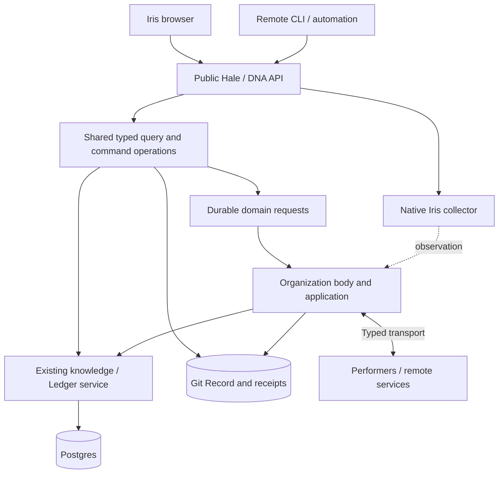
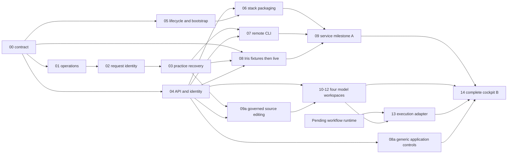

# DNA services, shared API and Iris — development plan

Status: staged implementation plan, updated 2026-09-18. Parent product issue:
[#690](https://github.com/hale-lang/hale/issues/690). No API or container stack
is implemented by this document. Suggested paths, commands and card names below
are implementation targets, not claims about commands that already ship.

Implementation has begun with the [source-built read API](api/README.md):
the read subset of 00, typed query extraction from 01, and a loopback/OIDC
read-only head from 04. This does not complete those cards: mutation contracts,
durable command recovery, position context and deployable service composition
remain pending. The experimental wire schemas live under `dna/api/contract/v1`.

The [first Iris browser slice](../iris/cockpit/README.md) implements the read-only
part of 08: same-origin serving, capability-based navigation, practice/review
browsing and a connection to the independent Runtime observer. It does not
complete 08 or milestone A. The next administrative slice still requires
02–03 and the command portion of 04. Organization, Knowledge and Definitions
remain first-class deliverables in 10–12.

The cockpit branch additionally implements the declared-structure read portion
of 10: native compiler artifact/ownership projections, captured dependency basis,
and a browser outline/inspector. Source-governed semantic position bindings,
purpose, performers, effective context and administration still remain. The
[delivery checklist](../iris/cockpit/DELIVERY.md) preserves both full milestones
and all four product proof loops; a read-only workspace does not complete them.

## 1. Decision and deliverables

Build a first-class Hale/DNA service API, used by both Iris and remote CLI
operations. Package a reference single-host deployment through Docker Compose.
Preserve native local development and the existing domain authorities. The
reference deployment initially uses existing messaging and durable relay; it
does not require an external broker.

Deliver two milestones:

- **A — usable service deployment:** a fresh project starts its state service,
  body, API and observer; a browser and a CLI outside the project can inspect
  practices, submit a revision, decide the exact proposal and follow its real
  outcome. Restart and retry preserve request identity. This is a complete
  vertical slice, not a claim that the whole cockpit is complete.
- **B — complete core cockpit:** Organization, Knowledge, Practices and Task/
  Workflow Definitions all support viewing and authoritative administration,
  joined to live work and generic Hale runtime observation. The active position
  changes the working context. The four proof loops in #690 pass, including
  non-code work and ordinary Hale without DNA.

The API belongs to the services. Iris owns presentation. CLI bootstrap/build
commands continue to work before an API exists; remote operational commands use
the same API as Iris. Shared domain operations sit below both local and remote
entry points, so validation and mutation semantics do not fork.

| Delivery stage | Cards | Concrete result |
| --- | --- | --- |
| Contract and read access | 00–01, read-only 04, 05 | Shared fixtures; independently running state/API; typed practice reads |
| Trustworthy remote changes | 02–04, 07 | Durable identities, recovered domain results, authenticated browser/CLI parity |
| Service milestone A | 06, 08–09 | Generated runnable stack and first complete practice revision/review loop |
| Core administration | 08a, 09a, 10–12 | Generic controls; source changes; all four model workspaces |
| Cockpit milestone B | 13–14 | Recursive execution joins and complete authoring-to-outcome proof loops |
| Optional distribution extension | 15 | Broker adapter only for a demonstrated transport requirement |

## 2. Evidence baseline

The original audit compared main [`2f202c90`][main] with pending workflow stack
[`cd8dcc43`][pending]. On September 18, main `9a3136ca` was integrated: workflow
cards 00–06 and the request-relay fix #692 are merged. Definitions, durable codecs
and pure execution projection are now native foundations. There is still no
live `wf1` executor or catalog HTTP exposure at that revision; admission #696
was open at the update and itself adds no dispatch. The table below separates
these foundations from the service and browser contracts still required.

At the original audit, source and existing test bodies were inspected. Two targeted native tests were
run with the supplied Hale 0.20.0 binary against the isolated main source:
`principal_test.hl` and `knowledge_events_test.hl`; both passed. The latter uses
temporary Git fixtures. The compiler was not rebuilt or proven to correspond
exactly to the inspected source revision.
That audit performed no new full-suite, Docker, Postgres, browser-authentication
or distributed-runtime acceptance run. Passing those two tests does not establish the
new service/API contract.

### What is already there

| Area | Implementation and usable foundation | Gap for this delivery |
| --- | --- | --- |
| Project generation | `hale dna new/init` generates ordinary organization source, pinned vendored DNA, Record and a Compose file. | Compose contains only `knowledge-db`; it is not a complete application deployment. [S1] |
| Local host | `dev` manages organization, application, state service and Iris as native processes. `run` manages the organization and deployment path, with external state when required. | External-service ownership and readiness must be explicit; wrapping `dev` in a container would still invoke local infrastructure machinery. [S2] |
| State service | `dna/knowledge/service` owns Postgres-backed knowledge, Ledger, leases and protected bodies. Domain interfaces have memory implementations. | Internal routes are not a complete authenticated public API; no full graph/admin query surface. [S3] |
| Durable memories | Record is Git-backed; routing 0 keeps events there, adopted routing 1 moves operational event families to Ledger. Each kind has one home. | Deployment must preserve both stores, identity, adoption and protected-body keys; Postgres alone is not a full backup. [S4] |
| Messaging | Typed local membrane, native Unix sockets, append-before-publish request paths and host relay. Record sync and service calls support existing remote configurations. | No mandatory broker adapter. Command-level correlation/recovery still needs work; generic Iris publish acknowledgements are not durable command results. [S5] |
| Browser head | `dna/ui` supplies existing OIDC sessions; `dna/api` shares typed practice/review queries with the CLI and serves the read-only cockpit. | Legacy `dna/ui` command routes still run CLI subprocesses and omit exact-subject preconditions. The new API does not expose those routes; durable commands and position context remain work. [S6] |
| Domain administration | Practices have proposal/review/ratification/supersession; organization changes have governed source paths; knowledge has ideas, bindings and provenance. | Browser model catalogs and deterministic domain edit operations are incomplete. [S7] |
| Recursive workflows | Merged cards 04–06 supply definitions, bound recipes, event codecs and pure projection. | Expose an application-declared catalog and read facts from their routed memories; connect live executions only after admission/runtime integration. Iris must not implement the missing executor. [S8] |
| Observation | Native collector provides `/snapshot` and SSE over shared-memory observations. | Container placement, authenticated publication and joining application identities need work. Observation is lossy and is not durable command history. [S9] |
| Packaging/tests | A compiler/toolchain Docker image, release packaging, native test suites and Postgres CI service exist; the cockpit adds browser interaction coverage. | There is no complete DNA service image/stack acceptance gate. Existing `fleet_compose.rs` tests topology composition, not Docker Compose. [S10] |

The detailed four-workspace matrix remains in
[COCKPIT-READINESS.md](../iris/COCKPIT-READINESS.md).

### Consequential findings

1. **The public API cannot safely be a JSON wrapper around repeated CLI calls.**
   `practice_verb` mints a new time-based id on each invocation. HTTP retry needs
   an identity captured before transmission and recovered after a lost reply.
   Practices/reviews are Record events, so Ledger's request table does not solve
   this first slice. [S7]
2. **Existing Ledger deduplication is narrower than the proposed API promise.**
   Its request table maps id to revision, without principal/payload fingerprint;
   append, authorship and request marking are separate operations. Strengthen
   that boundary before advertising concurrent, restart-safe remote operational
   commands. Do not assume an idempotency header fixes the domain. [S11]
3. **A command has several effects and may stop between them.** Practice handling
   can append proposal/review facts before its final answered marker. Recovery
   must continue the same operation rather than duplicate intermediate work.
   Review approval also precedes knowledge adoption checks; an approved Review
   can coexist with a refused supersession. Present both facts. [S12]
4. **Startup has an ordering constraint.** Ledger adoption requires no live body.
   Adopted/shared bodies need the state service to acquire/check their lease;
   current `dev` starts its own knowledge service later in startup. Start state
   independently, initialize/adopt explicitly, then admit the body. [S13]
5. **HTTP availability is not readiness.** The state service can answer while its
   store is unavailable. Bootstrap needs a storage-ready condition distinct
   from body-ready or fully-operational API capabilities. [S3]
6. **The observer is physically local to observed processes.** It needs registry,
   shared-memory and PID visibility. A database/API connection cannot replace
   these. Start with the collector beside the body/application. [S9]
7. **Identity is not just a username.** OIDC subject, mapped member, owning party,
   selected position and grants are separate. Internal owner keys and caller-
   supplied receipt readers are not end-user API credentials. [S6, S14]

## 3. Target architecture and reference deployment



`Requests` is a logical path through existing Record/Ledger authorities, not an
extra queue service or third database. API acceptance precedes domain completion.
The body and admitted work continue when the browser or API process exits.

### Reference Compose components

| Component | Responsibility | Persistence / exposure |
| --- | --- | --- |
| `knowledge-db` | Postgres/pgvector, retaining the current service name for compatibility | Named database volume; no public production port |
| `dna-state` | Existing knowledge/Ledger/lease/protected-body service | Internal network; DSN and evidence key here, not in clients |
| `dna-bootstrap` | One-shot, resumable validation and explicit Ledger adoption for the new service profile | Checks project/Record identity and stopped-body requirement; never initializes over existing state |
| `dna-body` | Existing host, organization, reference local application and native observer | Project/Record and runtime mounts; retains body lease/fencing; internal observer endpoint |
| `dna-api` | Authentication, typed API, operation facade and Iris static assets | Public development port bound to loopback; hosted profile behind TLS; no database credentials |

The deployment separates state, body and API lifecycles. It does not need five
different image implementations: a pinned DNA-capable image can expose several
entrypoints, while each container runs one supervised responsibility. The body
retains its existing responsibility for its child process tree.

The initial topology is one project/Record, one active body per existing ownership
rules, and one active API ingress per Record. Multiple people/clients are supported.
Horizontal API writers in independent Git clones are a separate capability that
must prove cross-clone request uniqueness; local ref CAS alone does not prove it.
This bound does not remove DNA's existing multi-owner/fleet features.

For the reference single-host stack, use one persistent project/Record volume
visible to the state, body and API where existing Record operations require it.
The body owns checkout/build/expression changes. Other services use their typed
Record operations, not arbitrary source checkout or shell endpoints. Retain
existing Record CAS semantics. Separate-clone deployments need an explicit sync
owner and their own consistency tests: the current state service refreshes its
local Record but relies on the host to fetch remote changes. A standalone state
clone must not authorize from indefinitely stale ownership or policy.

Keep scratch sockets, pid files and observation registries distinct from durable
Record/receipts. Preserve any unsent CLI queue (`.hale/dna/queue`) and client
request-recovery metadata; do not classify every `.hale` path as disposable.
Compiler caches are replaceable and isolated from durable volumes.

Initially colocate the observer with the body/application in the same PID and
shared-memory context. Publish its read surface through the authenticated API.
Remote fleet nodes later expose one local collector per node. A separate
collector container requires tested registry, IPC and PID namespace sharing;
mounting the registry alone is insufficient. No Docker socket or host-wide
privileged container is needed for the reference stack.

Container networking needs explicit bind-host configuration: the existing HTTP
server defaults to loopback. Set private service listeners for container access,
use service DNS in URLs/DSNs, and retain loopback defaults for native development.
Publishing a port does not make a loopback-only container listener reachable.
Scope volumes and credentials to the deployment/Record; project-name sanitizing
and the current 100-bucket host-port hash do not establish unique identity. [S15]

### Bootstrap and compatibility policy

1. `new/init` prepares source and initializes a Record once, as today.
2. Start Postgres, then state; wait for database access and correct Record scope.
3. Run the service-profile bootstrap with no live body. For a fresh service
   profile, adopt Ledger explicitly and retain the checkpoint. Existing native
   projects remain on their current routing until an operator chooses migration.
4. Start the body after adoption is established; acquire the existing lease and
   bind the membrane. Start the API once its authentication and read dependencies
   are ready. API reads can remain available when the body is down.
5. Report body/command unavailability per capability; do not restart healthy
   bodies merely because Iris disconnected.

On restart, bootstrap recognizes the existing Record and adoption. Repeated `up`
with an already-adopted, healthy intended body performs validation only and
succeeds. If bootstrap previously stopped between copy and checkpoint, require
the body stopped and resume the existing adoption; do not repeat initialization
or claim a new body. A competing live body or mismatched Record/database identity
refuses startup instead of stealing ownership.

Preserve current `dna/compose.yaml` and native `dev` behavior. Prefer generating
an additional `dna/compose.services.yaml` overlay so the complete proposed stack
is launched explicitly with both files. This avoids having existing native
`dev` accidentally start another body/API when it provisions its database.
Existing project-owned files must not be overwritten by an upgrade. The generator
prints the exact command; no undocumented service ordering is left to the user.

The intended generated-project launch is the following **after card 06 ships**;
the second file does not exist in today's generated projects:

```sh
docker compose -f dna/compose.yaml -f dna/compose.services.yaml up --wait
```

Declare and test the minimum supported Compose version, including the mechanism
used to remove inherited development ports from the merged service profile.

`dev` with an explicitly configured external state URL must skip owning/starting
that service and skip nested Compose. With no external URL it retains today's
local convenience. `run` retains its separate-service/fleet behavior. Correct the
generated documentation that implies a DSN alone makes `run` start knowledge:
the DSN belongs to the separately running state service; consumers use its URL.

### API and client boundary

The existing [contract draft](../iris/COCKPIT-CONTRACT.md) describes identities,
context, evidence basis, commands and versions. Refine it into a service-owned
machine-readable contract in card 00; use `/api/hale/v1` for this draft's generic
application resources with optional DNA resource families. Iris-specific layout
and aggregation never become required domain storage.

Implement shared operations in a Hale seed such as `dna/operations/`, imported
by a new `dna/api/` head and by local CLI adapters. Keep `dna/core` responsible
for admission and execution. Start extraction with practices/reviews; do not
move the whole CLI in one rewrite or parse its formatted terminal output.
Keep the generic public facade and provider contract in a DNA-independent seed
such as `iris/service/`; the DNA head composes it with DNA adapters. Ordinary
applications use that facade with native observation and explicitly registered
application/supervisor operations. They do not need a DNA project or Postgres.

The first remote command set is deliberately bounded: practice list/detail,
proposal, exact-digest verdict, context and command lookup. A command discovery
response advertises support and authority separately. Unsupported remote verbs
fail explicitly; they never silently fall back to mutating a local project.
Existing init/build/check, repository setup and offline repair remain local.

Hosted browser sessions can reuse the existing OIDC foundation. Remote CLI
authentication is new work: provide short-lived, revocable credentials bound to
the same resolved principal and application, obtained through an authenticated
login path. Specify and review that exchange before accepting remote mutations;
do not treat `--as`, a member name or an internal owner key as a login. Avoid
storing credentials in the repository or accepting secrets in logged arguments.
For the first deployment, use one documented CLI login mode and test it against
the local OIDC fixture before adding provider-specific alternatives.
Specify session restart behavior separately from command persistence: existing
in-memory sessions may require login again, but that must not lose an accepted
request or change the principal required to recover it.

### Command persistence decision

For DNA, use the native domain request as the durable acceptance fact, carrying a stable
command/request identity, principal scope, operation version and canonical
payload fingerprint. A command receipt is a projection of those facts and their
results. Do not add an independently authoritative API database.

- Record-owned operations use checked read/compare-and-append against Record.
  On a stale head, reload and check identity/content again before appending.
  Recover mappings from the recorded fact itself; an independent pointer/index
  may accelerate lookup but cannot be the only proof of acceptance.
- Ledger-owned operations need transactional admission of the request identity,
  fingerprint, author and row. The current append-then-mark sequence is not
  sufficient. Implement the transaction inside the existing state service/store.
- Same principal/application/request id and equivalent validated content returns
  the original command; changed content or context is a conflict. Persist recovery
  metadata before a client sends. After an ambiguous response, recover by that id.
- Delivery, domain proposal, Review decision and activation have separate facts.
  Make the practice handler recoverable at each append boundary. Do not claim
  universal exactly-once external effects; unresolved effects remain explicit.

Keep event-family routing intact. Practice/review requests remain governance
Record operations even when ordinary work uses Ledger. Apply exact-subject and
authority checks at the authoritative decision point, not only at HTTP parsing.
Generic applications supply their own capability providers and authoritative
outcomes (card 08a). The shared envelope does not require their state to be stored
in Record/Ledger or invent durable recovery where a provider cannot offer it.

## 4. Implementation cards

Each card is a bounded review unit, or a short stack where specified. `Depends`
lists prerequisites; disjoint cards can proceed in parallel. File paths are
existing ownership boundaries plus explicitly proposed new files. A passing
fixture schema alone never substitutes for the live acceptance listed here.

### 00 — Publish the shared contract and conformance fixtures

**Depends:** none. **Owner:** API/domain maintainers with Iris consumer review.
Promote the prose contract into OpenAPI plus JSON Schemas under a proposed
`dna/api/contract/v1/`. Freeze only the first slice: principal/context,
capabilities, practice/review/context reads, command submission/lookup and typed
errors. Define source watermarks, opaque ids, request equivalence, response
states and version compatibility. Include plain-Hale discovery/runtime fixtures.

**Done:** request/response examples validate; negative examples reject actor
spoofing, unknown mutation fields, stale subject, conflicting request reuse and
unsupported capabilities. Both a fixture client and server-side codecs consume
the same examples. Publish missing backend fields explicitly rather than filling
them with invented state. Broader resource families are versioned as added.

### 01 — Extract typed practice/review operations from terminal rendering

**Depends:** 00. **Owner:** domain/API lane.
Refactor the relevant parts of `dna/host/writers.hl`, `projection.hl` and review
queries into `dna/operations/`. Inputs carry native ids and explicit subject
digests; outputs carry data and structured failures. CLI adapters retain current
human output. Preserve multiline text, Unicode, slash-bearing positions and
Record provenance. Fix the existing head's lossy sanitizer/status handling in a
small regression-backed compatibility change, without extending its trust model.

**Done:** old local CLI output/exit behavior remains compatible; structured and
terminal calls invoke the same domain functions. No subprocess-output parsing
is needed for the new first-slice HTTP paths. Tests cover malformed input and
domain failure as well as successful listing/proposal.

### 02 — Make remote request identity durable in both memories

**Depends:** 00–01. **Owner:** Record/Ledger maintainers.
Add caller-supplied request identity to the typed submission path, canonical
fingerprint and principal/application scope. Implement Record compare-and-append
recovery and the Ledger transactional equivalent described above; update memory
implementations. Define retention and explicit expired/unknown lookup results.
For milestone A retain accepted command identities for the Record's lifetime;
projection/index expiry never establishes that a command was not accepted.
Never label a merely queued local request `recorded` by the remote authority.

**Done:** concurrent same-key calls produce one domain request and the same
receipt; same-key/different-content conflicts. Inject failure after append but
before reply/index update, restart the head/store, and recover the original.
Cover Record-governance and Ledger-operational paths separately. Test author
binding and changed authority at resubmission. No atomicity claim spans Git and
Postgres without a resumable protocol.
Expiring/rebuilding a lookup index cannot readmit the same mutation. Recovery
reads still enforce current access; possession of a request id is not a grant.

### 03 — Close the practice proposal/review recovery loop

**Depends:** 01–02. **Owner:** DNA domain lane.
Make proposal handling and its bounded multi-fact progression recoverable under
the same native request identity. Touch `dna/core/assembly.hl`, knowledge events
and host correlation where necessary. Retain deterministic document/Review
identities and explicit refusal. Project Review decision independently from
ratification/supersession; a stale predecessor can refuse adoption after approval.
Reuse the concern request-correlation fix merged in #692; it does not complete
the practice/verdict command-identity contract described here.
Carry each verdict's command identity through relay, decision and durable
accepted/refused result. The existing paths correlate verdicts by Review id,
which cannot distinguish two clients deciding the same Review. Explicitly
declare whether the first slice supports abstention; its current in-memory
path emits no settled event and needs its own durable command outcome if exposed.

**Done:** kill/restart at each proposal/review/ratification append boundary,
including between ratification and predecessor retirement. After Record/receipt
access recovers, converge to the same logical proposal/Review and one applied
or refused outcome. Unresolved is an interim or diagnosed-corruption state,
not a passing ordinary-restart result. Two competing revisions cannot both
replace the same active predecessor.
Replayed verdicts do not change the reviewed digest or duplicate effects.
Two concurrent verdict commands for one Review retain distinct attributed
receipts and cannot borrow each other's answer. Include abstention recovery if
that operation is advertised.

### 04 — Build the authenticated service API and remote-client identity

**Depends:** 00; live mutation enables only after 01–03. **Owner:** API lane.
Create the independent `dna/api/` head, with reusable authentication and generic
dispatch in a DNA-independent `iris/service/` seed; reuse principal/session logic from
`dna/ui` and extend the existing owner admission checks to Record-governance
commands. Those commands bypass `/ledger/append`, where current owner/retirement
checks live. Add session/context introspection,
typed errors, request-id lookup and operation capability responses. Define and
implement the bounded CLI login/credential mode. Derive actor and authority on
the server, preserving the owning-party boundary. Position selection is a view;
acting from a position requires an explicit permission response and recheck.
For the first slice, check current authority at durable acceptance and again
before a delayed command makes its domain decision. Revocation before that
decision produces an attributed refusal; replay does not reconsider a completed
decision under a newly privileged actor. Keep this policy explicit in fixtures.

**Done:** browser and CLI map to the same principal and request attribution;
first-slice practice `Idea.author` remains `org`, with the human recorded separately
in request/proposal provenance. Absent, expired, revoked and wrong-owner
credentials fail. Caller-supplied person/role
cannot elevate authority. Mutation origin/CSRF behavior is tested for the chosen
session deployment. Internal append/lease/receipt APIs are not exposed through
an unrestricted public reverse proxy. No body needs to run to serve retained reads.
Wrong-owner and retired-member Record commands fail, including a verdict queued
before retirement but executed afterward. Restart the API, authenticate again
as the same person if required, and recover the same accepted command.

### 05 — Decouple service ownership and implement readiness/bootstrap

**Depends:** 00; independent of frontend. **Owner:** host/state lane.
Honor an external state URL in `dev`; keep existing managed-local mode. Add
separate liveness, storage readiness and body/capability readiness. Implement the
resumable service-profile bootstrap with stopped-body checks and Record-scoped
Ledger adoption. Reuse `record_verbs.hl` adoption and lease semantics rather than
making a second migration path. Bootstrap must recognize already-adopted state.
Add explicit bind-host options and service-DNS configuration for private HTTP
listeners. Keep native loopback defaults. Define who refreshes/fetches the Record
for any supported topology that gives the state service its own clone.

**Done:** no nested Docker/systemd invocation when services are externally
managed; adoption can complete before any body starts; interrupted copy/checkpoint
resumes. Wrong database scope, unavailable lease authority or a live competing
body blocks startup. API reads may be ready while body commands are unavailable.
Test concurrent starts and container replacement against owner-scoped lease
epochs; a stable hostname is not a fencing guarantee. Verify policy freshness
before admitting commands after a disconnected state service rejoins.

### 06 — Package the reference service stack

**Depends:** 04–05. **Owner:** packaging/CLI maintainers.
Extend the existing toolchain-image machinery with DNA runtime dependencies and
cached/prebuilt head, state, host and observer binaries. Audit git, certificates,
process tools, curl, linker/FFI libraries and signal handling in the final image;
the compiler image's hello-world smoke test is not a DNA service smoke test.
Generate the additional Compose overlay with explicit startup dependencies,
volumes, internal networking, pinned toolchain image and health checks.
Add an actual Postgres healthcheck; the generated base file currently has none.
Container clients use service DNS rather than the host-side loopback DSN.

Resolve the build-cache contract: current launchers open a writable `.build.lock`
even when a binary is already cached. Use supported prebuilt entrypoints or
an explicitly UID-owned writable cache with exact compiler/source identity;
a read-only warm cache alone is insufficient. The Postgres driver is pure Hale
pgwire, so it does not imply a `libpq` runtime dependency. [S16]

Keep observer/body in one process namespace initially. Preserve stop/fence
behavior for descendants. Handle project ownership/UID, deterministic paths and
deployment-scoped volumes and credentials. Remove the inherited database host
port in the service profile unless explicitly requested; support collision-free
port overrides for multiple native projects. Check the merged `docker compose
config`: merely omitting an inherited published port or explicit volume name
from the overlay does not remove it. Existing project files are
kept; upgrades produce a reviewable addition/migration. Thin launcher/scaffolder
changes live with the CLI maintainers in `crates/hale-cli/src/dna.rs`; this card
requires no language/compiler-semantic change.

Preflight declared model/performer adapters in the actual container environment.
Host discovery can emit loopback model endpoints and tools available only on
the host; require explicit reachable endpoints, installed tools and confinement
for the selected adapter. Do not infer container readiness from credential presence.

**Done:** a clean generated project starts with the printed Compose command;
no host compiler, hidden source-tree dependency, Docker socket or manual process
ordering is required after generation. Restart keeps Record/database identity;
stop removes children and releases/fences ownership; a second body cannot execute
concurrently. Missing optional model credentials leave the deterministic example
and administration usable with honest capability status.
Run this test as the documented non-root UID, and test one configured real
adapter separately from deterministic fixtures. Observation attaches successfully;
paired cross-process edges appear only when the required wire instrumentation
is enabled on both peers, with coverage disclosed otherwise.

### 07 — Make remote CLI operations real API clients

**Depends:** 01–04. **Owner:** CLI/API lane.
Add an explicit endpoint/context option and login flow for the first command set.
Resolve remote mode before local project discovery, so it works outside a clone.
Persist request recovery metadata before transmission; provide machine-readable
output and meaningful exit codes. Preserve native local operations and explicit
offline queues. Never silently retry a mutation with a newly minted request id.

**Done:** from a directory containing no Hale project, a signed-in CLI can list,
propose, review and recover the same first-slice objects as Iris. Network loss
after admission recovers one request. An unsupported remote verb reports that
fact instead of running locally. Credentials do not appear in process arguments,
logs or repository configuration.

### 08 — Build the Iris shell and complete the first live slice

**Implemented subset:** the source-built cockpit serves with the Hale API and
browses Practices and Reviews, with source revisions, authenticated data,
pagination and failure states. Runtime links to the existing independent
observer. The three other core model workspaces remain unavailable until their
adapters exist. Browser tests exercise the real Record/API path and controlled
failure responses. This is read-only progress, not completion of this card.

**Depends:** fixture work after 00; live completion after 03–04. **Owner:** Iris.
Build an independently produced browser bundle with generic runtime support and
DNA adapter modules. Establish application/position selection, deep links and
versioned query caching. Keep Organization, Knowledge, Practices and Definitions
visible as core workspaces; fixture mode is explicit. Use the first API slice
for the practice catalog, exact-document review, context and receipt history.
Introduce browser interaction tests; existing CLI/native tests do not exercise JS.

**Done:** a person revises a practice, sees pending review, decides the exact
document and sees its actual adoption/refusal. Changing position invalidates
old query results. Reconnect recovers the existing command. The current edit
scope is explicitly organization-wide; arbitrary per-position activation is
not simulated. An ordinary Hale app shows useful runtime views without DNA.

### 08a — Supply generic application administration without DNA

**Depends:** 00, 04; browser integration with 08. **Owner:** Iris/runtime lane.
Implement the generic provider registration and dispatch boundary in
`iris/service/`. Map native observations with application/instance identity;
register named operations from the application's or supervisor's explicit
configuration. A runtime graph does not automatically grant control of its loci.
Each provider declares input schema, authority, preconditions, result meanings
and recovery/retention capability. Observation controls and application commands
remain distinct operation families.

Ship a small plain-Hale fixture with one real revision-guarded configuration
operation, such as its own intake mode, and an application-owned durable receipt.
This is a proof adapter, not mandatory application policy or another universal
scheduler. Providers lacking durable outcomes must declare that limitation;
the API never upgrades a transient publish acknowledgement to recorded completion.

**Done:** start the app, observer and generic API with no DNA Record, DSN, body
or state service. Invoke the declared control through Iris and the API client,
observe the actual changed configuration, reject a stale revision, and recover
the same result after API and target restart. A new runtime instance cannot be
confused with the old target. An unregistered or unauthorized operation fails.
Generic observation remains usable when the app exposes no control capabilities.

### 09 — Reach milestone A and make it recoverable

**Depends:** 02–08. **Owner:** cross-lane acceptance.
Run the generated stack with deterministic models and a local identity-provider
fixture. Exercise browser and remote CLI against the same deployment. Add CI
jobs that actually build/launch this stack, not just validate its YAML. Document
native versus container commands, URLs, logs, migrations and persistence.

**Done:** the milestone-A acceptance matrix below passes, including API restart,
body failure, database loss/recovery, competing clients, stale approvals and
observer coverage. Exercise a quiesced backup/restore of Record + Postgres +
required evidence key, validating matching checkpoints and retained receipts.
An incompatible stored/API version refuses clearly. No silent destructive
rollback or automatic Ledger abandonment is offered.

### 09a — Define bounded source editing and governed activation

**Depends:** 00, 02–04. **Owner:** source/domain lane; shared by 10 and 12.
Define an owned module/source shape for structured organization and catalog
editing, with deterministic parse/emit or a lossless mapping for that supported
shape. Hale source can express more than a form can safely edit. Preserve
unrelated handwritten code and advertise unsupported structures as inspectable
or source-edit-only; never silently regenerate an arbitrary application.

Each edit carries a base source revision and produces an exact candidate digest,
human-readable diff, validation result and affected references. Compile/check
the whole affected assembly/catalog before submitting through the existing
governed change path. Distinguish source accepted, deployment requested and
running revision; reuse body activation rather than applying source in the API.

**Done:** round-trip an untouched supported module without semantic changes;
perform an edit while preserving handwritten neighbors. A concurrent source
change conflicts without clobbering it. Invalid candidates install nothing.
Restart between accepted source and activation recovers the same change and
eventually reports the actual running revision or an explicit activation failure.

### 10 — Organization queries and governed position administration

**Depends:** 00, 04; live edits use 02–03 patterns and 09a. **Owner:** domain + Iris.
Project declared positions, purpose, ownership, performers, work references and
effective contextual permissions. Preserve distinct relation kinds. Add explicit
source-backed proposal operations for position/responsibility changes, retirement
and supported reassignment. Show impact on current obligations; never maintain
an independent editable org tree in the frontend database.

**Done:** inspect the org from two positions, propose and adopt a supported
change, and trace it to source/Record and affected work. Retirement preserves or
reassigns obligations through domain rules. Layout movement alone changes no
authority. A position inspector does not impersonate its occupant.

### 11 — Knowledge graph queries, edits and scoped practice lifecycle

**Depends:** 00, 04; editing uses 02–03. **Owner:** state/domain + Iris.
Extend `dna/knowledge/store.hl` and service APIs with bounded node/edge/binding
enumeration, neighborhood queries, provenance and dependency references. Reuse
the proposal/ratification path for supported corrections, bindings, retirement
and supersession. Add explicit position-scoped practice authoring only with
domain checks for author/target/tower relationships and current owner authority.

**Done:** browse and revise a linked assertion/practice, see why and where it
applies, and follow resulting context changes. Preserve historical evidence;
redacted/inaccessible items do not leak through graph edges, counts or search.
Unsupported edit kinds are declared unavailable. Add typed retrieval to the
store interface instead of scraping rendered context text.

### 12 — Authoritative task/workflow definition catalog and editor

**Depends:** 00, 04, 09a, pending definition contract/code from #687/#691.
**Owner:** workflow/domain + Iris.
Expose the real `WorkflowCatalog` with exact revision/child references and native
validation limits. Use code-authored definitions as the authority: draft edits
become a deterministic source change and governed activation, with catalog
projection derived from accepted source. Preserve structured/text round-trip.
Define publication/adoption explicitly; encode/decode alone is not a lifecycle.
The pending catalog has inline leaf members, not a separate reusable `TaskDef`
catalog. The editor must expose the actual leaf work fields: objective, contract,
target, requirements, context digest, knowledge bindings, data classification,
cost ceiling and retry allowance; also Step
membership/order and exact child-workflow revisions. Distinguish a reusable
definition, its leaf member specification and an admitted Work instance. Do not
invent a second authoritative task registry to fill that terminology gap.

**Done:** author and version a recursive definition, reject invalid cycles or
bounds, show dependent definitions, and publish through the real authority.
Earlier admissions keep their bound recipes and limits. Read/draft/validate may
ship before runtime adoption; `run` is advertised only after card 13 is connected.
No visual general-purpose Hale assembly editor is required for this card.
Edit a leaf and nested Step from revision N to N+1; once card 13 is live, prove
old admitted work retains N while a new admission resolves the published N+1.

### 13 — Connect recursive execution, history and runtime identities

**Depends:** 00, 04, 12; pending #693/#694 plus later workflow admission,
execution and recovery cards. **Owner:** workflow adapter + Iris.
Map authoritative recipe + pure projection + facts into structured reads. Reuse
the workflow team's joins/state transitions; the adapter does not schedule or
infer completion. Distinguish bound future nodes, admitted members, attempts,
accepted Work results, Step completion and child settlement. Identify legacy,
`wf1` admission and `wf1` refusal explicitly. Link to native runtime identities
only when an authoritative association exists.

**Done:** non-code work with a human obligation and a nested workflow survives
restart. Only the committed barrier allows the next Step; old attempts cannot
complete a retry; a cancelled execution can still show draining responsibilities.
Earlier attempts remain visible through history. No timestamps, running states
or successful results are invented from missing facts or process disappearance.

### 14 — Complete milestone B: all four workspaces and operational proof loops

**Depends:** 08a, 09–13 and supporting domain capabilities. **Owner:** cross-lane.
Run the complete authoring-to-execution loop: position → knowledge → practice →
definition → execution → evidence, then revise one dependency and inspect impact.
Complete generic Hale operation and governed application evolution through
deployment/observation, using existing fleet/change primitives. Add resumable
domain updates when their cursor contract is implemented; polling remains a
valid initial transport. Runtime samples keep their separate loss/coverage model.

**Done:** all #690 proof loops pass, with two actors/positions, exact candidates,
recorded refusals, concurrent edits and reconnect. UI/CLI receipts agree. Plain
Hale works without DNA services. The application continues through API/UI restarts.
Only this milestone claims the four core model workspaces are administrable.

### 15 — Evaluate an external broker against a demonstrated distribution need

**Depends:** a concrete cross-host worker/fleet requirement; not a gate for A/B.
**Owner:** transport/runtime lane.
Measure where existing native transport, Record relay and state-service access
are inadequate. If a broker is justified, add it behind typed transport with
explicit ordering scope, redelivery, request identity, owner fencing and recovery.
Retain domain facts as authority and keep the broker optional in deployment.

**Done:** the same domain conformance cases pass with the new transport, including
duplicate/out-of-order delivery, disconnect and uncertain external outcomes.
No frontend or public command schema changes merely because delivery changed.
Do not introduce a broker as a substitute for cards 02, 03 or workflow recovery.

## 5. Parallel work and merge order



After 00, three useful lanes can run concurrently: domain operations/recovery
(01–03), API/deployment (04–07), and Iris fixture development (08). Model work
(10–12) can start against declared fixtures/contracts while the first live slice
is integrated. Allocate backend ownership for each model; those gaps are not
frontend tickets alone.

Use short stacked branches with contract fixtures in each. Keep the service/API
branch based on main; import reviewed workflow changes through normal merges,
not by cherry-picking partial executor state. Keep compatibility fixtures for
both engines until the workflow team's migration retires legacy execution.

Workflow dependencies, updated September 18:

| Existing work | Relationship |
| --- | --- |
| #685 retry-attempt identity; #686 legacy recovery association | Merged correctness fixes. Preserve their tests; do not duplicate them in Iris. |
| #687 → #688 → #691 → #693 → #694 | Merged contract/lifetime → definitions → facts → pure projection stack. Reuse in 12/13. |
| #692, addressing issue #689 | Merged concern request/answer relay correction. Reuse it; practice/verdict command recovery in 03 remains separate. |
| Later workflow cards 07–19 | Admission, resident execution, transport/recovery and migration remain the workflow team's responsibility. Card 13 waits for the relevant native capabilities. |

Do not merge speculative public DTOs tied to unmerged row layouts as a frozen
v1. Stabilize semantics and operation-specific fixtures, then adapt native rows.
Every card states whether its surface is fixture-only, implemented or enabled
for this deployment; a build SHA is not capability discovery.

## 6. Acceptance and test ownership

| Gate | Required observation | Existing test foundations / new work |
| --- | --- | --- |
| Native compatibility | Local CLI, Record routing, lease/fence and existing practice semantics retained | `practice_test`, `routing_test`, `body_lease_start_test`, `body_lease_blocked_test`, `lease_epoch_test` |
| Request truth | Retry/reconnect/concurrent duplicate → one request; changed payload → conflict | Extend `two_heads_test`, Ledger/Record tests; new command admission crash-point fixtures |
| Authority | Correct subject/member/owner; selected position confers no grant; exact digest | `principal_test`, `principal_oidc_test`, `review_authority_test`, `knowledge_events_test`, `retired_admission_test`; new remote-token/context cases |
| Practice lifecycle | Proposal, Review decision, adoption/refusal and predecessor retirement remain distinguishable | `practice_test`, `knowledge_events_test`; new interrupted-progression/competing-supersession cases |
| Storage | PostgreSQL and memory implementations agree; transactions recover; record scope never crosses | `ledger_test`, `knowledge_store_test`, `two_owners_test`, `receipt_vault_test`, `receipt_retention_test`; do not silently skip the Postgres half in its CI job |
| Fresh deployment | Generated overlay boots, adopts once, exposes API and observer; no duplicate body | New actual Compose test using generated project, real Postgres and deterministic models |
| Lifecycle | API kill does not kill work; body kill/restart respects lease; state outage is explicit | Existing lease/recovery tests plus service-process failure tests and fresh-volume/retained-volume runs |
| Browser | Position changes, stale forms, draft/active separation, refusal, reconnect, same receipt as CLI | New browser test runner executing the real frontend, not just HTTP requests |
| Recursive work | Native recipe/facts/projection joined correctly; later steps wait; no replay of settled effects | Pending workflow tests plus card-13 adapter fixtures and live recovery cases |
| Generic Hale | Runtime inspection and supported admin work without a DNA record or service | Existing observation/fleet tests plus plain-Hale API/browser fixture |
| Migration/restore | Existing project files preserved; matching Record/Ledger restored; incompatible version explicit | New upgrade/backup/restore fixtures; no destructive fallback |

Run changed `.hl` files through `hale fmt`, `hale check` and the relevant native
tests. Reuse the repository's Rust integration harness where it already sets
`HALE_BIN`, `HALE_DNA_SOURCE` and isolated scratch roots. Add API-contract,
browser and real-stack jobs beside existing CI; the current compiler-image and
native suites are retained. Test filenames in the table refer to `dna/tests/*_test.hl`.
Register new native fixtures in the completeness list in
`crates/hale-cli/tests/dna_native_suite.rs`. Run Postgres tests only against a
dedicated disposable database: the existing harness can drop tables if creating
its private test database fails. A skipped database path is not a passing storage
gate. The generic-Hale test starts without a DNA Record, DSN or state service;
hiding the DNA panels in a fully provisioned DNA fixture does not satisfy it.

For repeatable checks, use scripted/recorded models and a local identity provider;
no paid model credentials or external GitHub mutation is needed for these gates.
Make test fixture paths/ports unique and run crash scenarios with bounded waits
and owned process cleanup. Never kill a developer's running body to test recovery.

## 7. Implementation order to start now

The first working stack should be small: card 00, typed practice queries from
01, authentication/read-only API from 04, and external-state/readiness changes
from 05. In parallel, build the four-workspace Iris shell against explicit
fixtures. Then complete 02–03 before enabling remote writes. Packaging and remote
CLI integration turn that into milestone A; broader models proceed toward B.

The critical path is trustworthy domain command recovery plus independently
managed service startup. Frontend layout is not the blocker, and adding a
broker would not shorten that path. Re-estimate delivery after 02–05 establish
the required native changes; calendar promises before those proofs would hide
the largest uncertainties.

This plan leaves business procedures, performer choices, org shape, review policy
and retry policy to the application. Its new platform commitments are access,
identity, versioning, durable requests, observable outcomes and deployment
composition—the fundamentals needed by either a CLI or a human cockpit.

## Source index

Sources are pinned to the inspected main revision unless marked pending. Line
anchors identify the entry point; follow the surrounding function for the full
operation. The notes distinguish implementation findings from proposed cards.

- **S1:** [generation and Compose](https://github.com/hale-lang/hale/blob/2f202c9094fff5f4219bd9ede6a1af0a4ba27ae3/crates/hale-cli/src/dna.rs#L617), [Compose template](https://github.com/hale-lang/hale/blob/2f202c9094fff5f4219bd9ede6a1af0a4ba27ae3/crates/hale-cli/src/dna.rs#L777).
- **S2:** [CLI host preparation](https://github.com/hale-lang/hale/blob/2f202c9094fff5f4219bd9ede6a1af0a4ba27ae3/crates/hale-cli/src/dna.rs#L66), [state startup](https://github.com/hale-lang/hale/blob/2f202c9094fff5f4219bd9ede6a1af0a4ba27ae3/dna/host/host.hl#L362), [host startup](https://github.com/hale-lang/hale/blob/2f202c9094fff5f4219bd9ede6a1af0a4ba27ae3/dna/host/host.hl#L741).
- **S3:** [state service ownership/open](https://github.com/hale-lang/hale/blob/2f202c9094fff5f4219bd9ede6a1af0a4ba27ae3/dna/knowledge/service/main.hl#L55), [store interface](https://github.com/hale-lang/hale/blob/2f202c9094fff5f4219bd9ede6a1af0a4ba27ae3/dna/knowledge/store.hl#L23).
- **S4:** [memory routing](https://github.com/hale-lang/hale/blob/2f202c9094fff5f4219bd9ede6a1af0a4ba27ae3/dna/core/routing.hl#L1), [Record API](https://github.com/hale-lang/hale/blob/2f202c9094fff5f4219bd9ede6a1af0a4ba27ae3/dna/core/record.hl#L67), [protected bodies](https://github.com/hale-lang/hale/blob/2f202c9094fff5f4219bd9ede6a1af0a4ba27ae3/dna/knowledge/protected.hl#L1).
- **S5:** [durable request before publish](https://github.com/hale-lang/hale/blob/2f202c9094fff5f4219bd9ede6a1af0a4ba27ae3/dna/host/writers.hl#L454), [relay](https://github.com/hale-lang/hale/blob/2f202c9094fff5f4219bd9ede6a1af0a4ba27ae3/dna/host/host.hl#L439), [Iris direct publication](https://github.com/hale-lang/hale/blob/2f202c9094fff5f4219bd9ede6a1af0a4ba27ae3/iris/consumer/fuse-hl/main.hl#L186).
- **S6:** [CLI-backed HTTP](https://github.com/hale-lang/hale/blob/2f202c9094fff5f4219bd9ede6a1af0a4ba27ae3/dna/ui/main.hl#L34), [sanitizer](https://github.com/hale-lang/hale/blob/2f202c9094fff5f4219bd9ede6a1af0a4ba27ae3/dna/ui/main.hl#L60), [routes and identity](https://github.com/hale-lang/hale/blob/2f202c9094fff5f4219bd9ede6a1af0a4ba27ae3/dna/ui/main.hl#L229).
- **S7:** [practice commands](https://github.com/hale-lang/hale/blob/2f202c9094fff5f4219bd9ede6a1af0a4ba27ae3/dna/host/writers.hl#L631), [knowledge model](https://github.com/hale-lang/hale/blob/2f202c9094fff5f4219bd9ede6a1af0a4ba27ae3/dna/core/knowledge.hl#L15), [organization](https://github.com/hale-lang/hale/blob/2f202c9094fff5f4219bd9ede6a1af0a4ba27ae3/dna/core/org.hl#L1).
- **S8, merged September 18:** [workflow contract](https://github.com/hale-lang/hale/blob/9a3136ca801d1f84282614b9eb5529554f94308b/dna/WORKFLOW-CONTRACT.md), [definition catalog](https://github.com/hale-lang/hale/blob/9a3136ca801d1f84282614b9eb5529554f94308b/dna/core/workflow_definition.hl#L1), [pure projection](https://github.com/hale-lang/hale/blob/9a3136ca801d1f84282614b9eb5529554f94308b/dna/core/workflow_projection.hl#L1).
- **S9:** [observer HTTP and SSE](https://github.com/hale-lang/hale/blob/2f202c9094fff5f4219bd9ede6a1af0a4ba27ae3/iris/consumer/fuse-hl/README.md), [shared-memory/PID attachment](https://github.com/hale-lang/hale/blob/2f202c9094fff5f4219bd9ede6a1af0a4ba27ae3/iris/consumer/obs_attach.c#L88).
- **S10:** [toolchain image](https://github.com/hale-lang/hale/blob/2f202c9094fff5f4219bd9ede6a1af0a4ba27ae3/Dockerfile), [CI/Postgres](https://github.com/hale-lang/hale/blob/2f202c9094fff5f4219bd9ede6a1af0a4ba27ae3/.github/workflows/tests.yml#L126), [topology composition tests](https://github.com/hale-lang/hale/blob/2f202c9094fff5f4219bd9ede6a1af0a4ba27ae3/crates/hale-cli/tests/fleet_compose.rs#L1).
- **S11:** [Ledger HTTP submission](https://github.com/hale-lang/hale/blob/2f202c9094fff5f4219bd9ede6a1af0a4ba27ae3/dna/knowledge/service/main.hl#L388), [request lookup/mark](https://github.com/hale-lang/hale/blob/2f202c9094fff5f4219bd9ede6a1af0a4ba27ae3/dna/knowledge/ledger.hl#L473).
- **S12:** [knowledge proposal progression](https://github.com/hale-lang/hale/blob/2f202c9094fff5f4219bd9ede6a1af0a4ba27ae3/dna/core/assembly.hl#L541), [decision and adoption](https://github.com/hale-lang/hale/blob/2f202c9094fff5f4219bd9ede6a1af0a4ba27ae3/dna/core/assembly.hl#L628), [practice handler](https://github.com/hale-lang/hale/blob/2f202c9094fff5f4219bd9ede6a1af0a4ba27ae3/dna/core/assembly.hl#L1490).
- **S13:** [adoption](https://github.com/hale-lang/hale/blob/2f202c9094fff5f4219bd9ede6a1af0a4ba27ae3/dna/host/record_verbs.hl#L329), [body/service checks](https://github.com/hale-lang/hale/blob/2f202c9094fff5f4219bd9ede6a1af0a4ba27ae3/dna/host/host.hl#L878).
- **S14:** [principal model](https://github.com/hale-lang/hale/blob/2f202c9094fff5f4219bd9ede6a1af0a4ba27ae3/dna/core/principal.hl#L1), [owner admission](https://github.com/hale-lang/hale/blob/2f202c9094fff5f4219bd9ede6a1af0a4ba27ae3/dna/knowledge/service/main.hl#L191), [CLI outbox](https://github.com/hale-lang/hale/blob/2f202c9094fff5f4219bd9ede6a1af0a4ba27ae3/dna/host/record.hl#L160).
- **S15:** [HTTP default bind](https://github.com/hale-lang/hale/blob/2f202c9094fff5f4219bd9ede6a1af0a4ba27ae3/crates/hale-stdlib/hl/http.hl#L497), [generated volume and port](https://github.com/hale-lang/hale/blob/2f202c9094fff5f4219bd9ede6a1af0a4ba27ae3/crates/hale-cli/src/dna.rs#L777).
- **S16:** [cache build lock](https://github.com/hale-lang/hale/blob/2f202c9094fff5f4219bd9ede6a1af0a4ba27ae3/crates/hale-cli/src/iris.rs#L40), [pure Hale Postgres driver](https://github.com/hale-lang/hale/blob/2f202c9094fff5f4219bd9ede6a1af0a4ba27ae3/dna/pond/pq/pq.hl#L1), [discovered local model endpoint](https://github.com/hale-lang/hale/blob/2f202c9094fff5f4219bd9ede6a1af0a4ba27ae3/crates/hale-cli/src/dna.rs#L1105).

[main]: https://github.com/hale-lang/hale/commit/2f202c9094fff5f4219bd9ede6a1af0a4ba27ae3
[pending]: https://github.com/hale-lang/hale/commit/cd8dcc43de744f28ec5f93b1a900f166bed2defd
